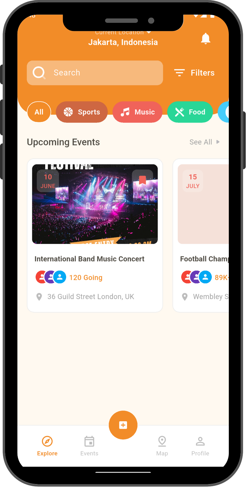
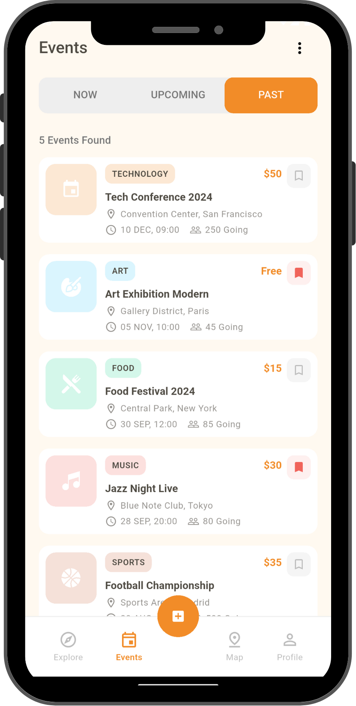
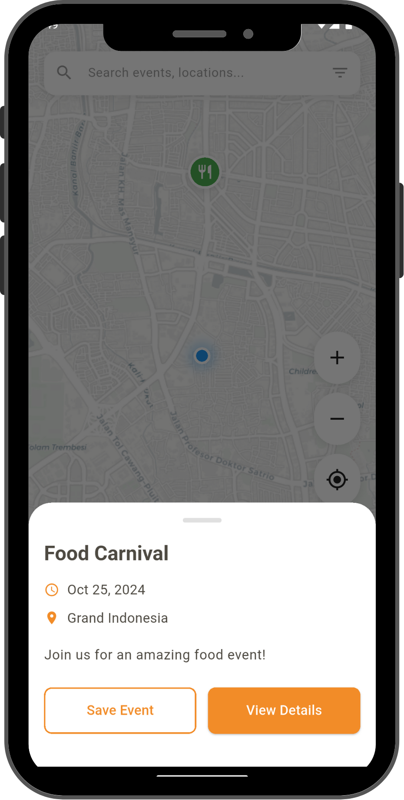

# 🎉 Event Booking App

<div align="center">


**Modern Event Discovery & Booking Platform**

[](https://flutter.dev/)
[](https://dart.dev/)
[](LICENSE)

</div>

## 📖 Overview

Event Booking adalah aplikasi mobile modern yang memungkinkan pengguna untuk menemukan, menjelajah, dan memesan berbagai event dengan mudah. Aplikasi ini dibangun menggunakan Flutter dengan arsitektur yang scalable dan UI/UX yang elegant.

## 🎨 UI/UX Showcase

### Onboarding Experience

<div align="center">
  
  
  
</div>

_Smooth onboarding experience dengan ilustrasi yang engaging dan informative_

## ✨ Features

### 🔐 Authentication & Onboarding

- **Interactive Onboarding**: Guided tour dengan ilustrasi custom
- **Login & Registration**: Secure authentication flow
- **Email Verification**: OTP-based verification system
- **Social Login**: Integration dengan Google & Facebook

### 🏠 Event Discovery

- **Home Dashboard**: Curated event recommendations
- **Category Filtering**: Sports, Music, Food, Art categories
- **Search & Filter**: Advanced search dengan multiple criteria
- **Interactive Map**: Location-based event discovery

### 📅 Event Management

- **Event Listing**: Comprehensive event catalog
- **Event Details**: Rich event information dengan booking
- **Bookmark System**: Save favorite events
- **Real-time Updates**: Live attendee count & availability

### 🎯 Smart Features

- **Pull-to-Refresh**: Seamless data synchronization
- **Shimmer Loading**: Elegant loading states
- **Responsive Design**: Optimal experience across devices
- **Dark/Light Theme**: Adaptive UI theming

## 🛠️ Tech Stack

### **Frontend**

-  **Flutter** - Cross-platform UI framework
-  **Dart** - Programming language

### **Architecture & State Management**

- **Stacked Architecture** - MVVM pattern implementation
- **Stacked Services** - Navigation, dialogs, bottom sheets
- **Loading Mixin** - Centralized loading state management

### **UI/UX Libraries**

- **flutter_screenutil** - Responsive sizing
- **flutter_svg** - Vector graphics support
- **pinput** - Elegant PIN input fields

### **Development Tools**

- **Golden Tests** - UI regression testing
- **Git Integration** - Version control with GitKraken support

## 🎯 UI Components Library

### **Core Components**

- `PrimaryButton` - Consistent button styling
- `CustomTextField` - Reusable input fields
- `CustomSwitch` - Animated toggle switches
- `CustomBottomNavBar` - Navigation component

### **Specialized Widgets**

- `EventCardWidget` - Event display component
- `EventCardShimmer` - Loading state component
- `ProfileHeader` - User profile display
- `HomeEventCard` - Featured event cards

### **Design System**

- **AppColors** - Centralized color palette
- **AppIcons** - SVG icon assets
- **AppImages** - Image asset management
- **Typography** - Consistent text styling

## 🚀 Getting Started

### Prerequisites

- Flutter SDK (>=3.0.0)
- Dart SDK (>=3.0.0)
- Android Studio / VS Code
- iOS Simulator / Android Emulator

### Installation

1. **Clone the repository**

   ```bash
   git clone https://github.com/srgjo27/event_booking.git
   cd event_booking
   ```

2. **Install dependencies**

   ```bash
   flutter pub get
   ```

3. **Run the app**
   ```bash
   flutter run
   ```

### 🧪 Testing

Run unit tests:

```bash
flutter test
```

Update golden test files:

```bash
flutter test --update-goldens
```

Golden test screenshots tersimpan di `test/golden/`.

## 📱 Supported Platforms

- **Android** (API 21+)
- **iOS** (iOS 12+)
- **Web** (Responsive design)

## 🎨 Design Philosophy

Event Booking mengadopsi **Material Design 3** dengan sentuhan modern:

- **Minimalist UI** - Clean dan tidak cluttered
- **Consistent Spacing** - 8dp grid system
- **Accessibility First** - Optimal contrast ratios
- **Smooth Animations** - 60fps performance
- **Responsive Layout** - Adaptive untuk semua screen sizes

## 📂 Project Structure

```
lib/
├── app/                    # App configuration & routing
├── models/                 # Data models
├── services/              # Business logic services
├── ui/
│   ├── common/            # Reusable UI components
│   ├── views/             # Application screens
│   └── bottom_sheets/     # Modal bottom sheets
├── utils/                 # Helper utilities
└── mixins/                # Reusable mixins
```

## 🤝 Contributing

Contributions are welcome! Please read our [Contributing Guidelines](CONTRIBUTING.md) for details.

1. Fork the project
2. Create your feature branch (`git checkout -b feature/amazing-feature`)
3. Commit your changes (`git commit -m 'Add some amazing feature'`)
4. Push to the branch (`git push origin feature/amazing-feature`)
5. Open a Pull Request

## 📄 License

This project is licensed under the MIT License - see the [LICENSE](LICENSE) file for details.

## 🙏 Acknowledgments

- **Flutter Team** - Amazing framework
- **Stacked Community** - Architecture guidance
- **Design Inspiration** - Modern event booking platforms
- **Contributors** - Everyone who helped build this project

---

<div align="center">

**Made with ❤️ using Flutter**

[⭐ Star this repo](https://github.com/srgjo27/event_booking) • [🐛 Report Bug](https://github.com/srgjo27/event_booking/issues) • [💡 Request Feature](https://github.com/srgjo27/event_booking/issues)

</div>
